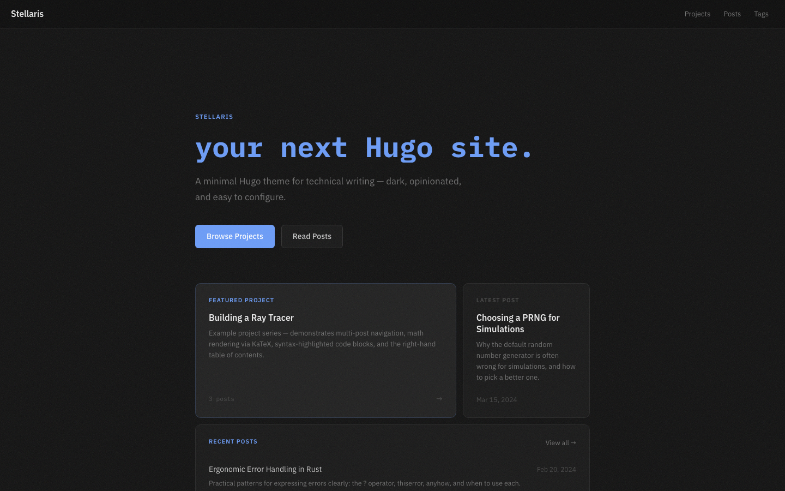
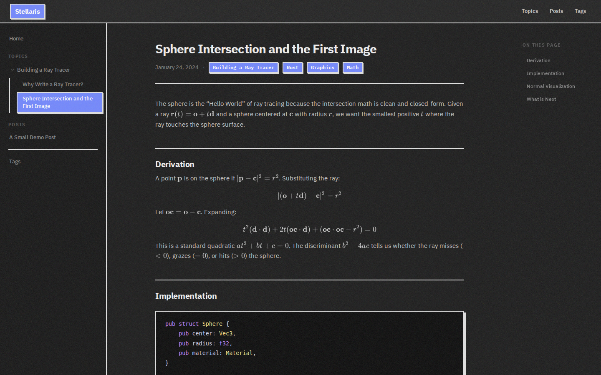

<div align="center">
    <h1>stellaris.</h1>
    <p>A minimal Hugo theme for technical writing — dark, opinionated, and easy to configure.</p>
</div>




Write in markdown. Ship something that looks good. Stellaris handles the rest — bento-grid home page, scrolling project ticker, sidebar navigation, KaTeX math, syntax highlighting, self-hosted fonts, the works.

**Requirements:** Hugo 0.146.0 or later (standard build, extended not required).

## Installation

### As a Hugo module

```sh
hugo mod init github.com/your-username/your-site
```

Add to `hugo.toml`:
```toml
[module]
  [[module.imports]]
    path = "github.com/inverted-tree/stellaris"
```

```sh
hugo mod get github.com/inverted-tree/stellaris
hugo server
```

To update: `hugo mod get -u github.com/inverted-tree/stellaris`

### As a local copy

```sh
git clone https://github.com/inverted-tree/stellaris themes/stellaris
```
```toml
theme = 'stellaris'
```

## Content

Two content types, kept separate:

```
content/
  posts/           # standalone posts
  projects/
    my-project/
      _index.md    # project metadata
      01-intro.md  # series posts
      02-part2.md
```

**Standalone posts** show up in the feed and on the home page. No fuss.

**Project series** group related posts under a project. Each post gets a series strip at the bottom linking to the others — but only if the project has more than one post.

Use `weight` on a project's `_index.md` to control the order they appear in navigation and on the home page.

### Front matter

```toml
title = 'My Post'
date = '2025-01-15'
description = 'Shown in post lists and the home page.'
tags = ['rust', 'graphics']
math = false   # set true to enable KaTeX on this page
```

### Images and other assets

Use a leaf bundle to keep assets next to a post:

```
content/posts/my-post/
  index.md
  diagram.png
```

Then reference as ``.

## Configuration

```toml
baseURL = 'https://example.org/'
title   = 'My Site'

[params]
  description    = 'A site about things I build.'
  heroTitle      = 'your next Hugo site.'   # typewriter text on the home page
  accentColor    = '#6b9cf8'                # any CSS color
  featuredProject = 'my-project'            # slug of the project pinned on the home page
  fontSans       = 'IBM Plex Sans'          # must match a @font-face family in fonts.css
  fontMono       = 'IBM Plex Mono'
```

### Accent color

One value, full palette. The theme derives all hover and tint variants automatically via `color-mix()`.

```toml
accentColor = '#f4845f'   # warm orange
accentColor = '#6b9cf8'   # deep-space blue (default)
accentColor = '#7ec8a4'   # muted green
```

### Labels and text

Every user-facing string has a sensible default and can be overridden:

```toml
[params]
  homeLabel        = 'Home'
  tagsLabel        = 'Tags'
  heroPrefix       = 'Built for'
  heroProjectsLabel  = 'Browse Projects'
  heroPostsLabel     = 'Read Posts'
  homeFeaturedLabel  = 'Featured Project'
  homeLatestPostLabel  = 'Latest Post'
  homeRecentPostsLabel = 'Recent Posts'
  homeViewAllLabel   = 'View all →'
  homeNoPostsText    = 'No posts yet.'
  seriesLabel        = 'Part of'
  footerText         = 'My Site'
  footerLinkText     = 'Built with Hugo'
  footerLinkURL      = 'https://gohugo.io'
  notFoundTitle      = 'Page not found'
  notFoundMessage    = "The page you're looking for doesn't exist or has been moved."
  notFoundLinkText   = 'Go home'
```

Section nav labels (Projects, Posts) are read from each section's `_index.md` title — rename the file, rename the nav entry.

## Math

KaTeX is self-hosted and loaded only on pages with `math = true`. Supported delimiters: `$...$`, `\(...\)`, `$$...$$`, `\[...\]`.

## Shortcodes

### `code`

A syntax-highlighted block with an optional filename label:

```

fn main() {}

```

`lang` and `file` are both optional. Language is auto-detected when omitted.

## Fonts

Ships with IBM Plex Sans, IBM Plex Mono, and IBM Plex Math, all self-hosted under `static/fonts/`. To swap in a different font:

1. Drop the woff2 files in `static/fonts/my-font/`
2. Add `@font-face` rules to `assets/css/fonts.css`
3. Set `fontSans` or `fontMono` in `hugo.toml`

Comment out either param to fall back to system fonts.

## Customizing styles

Design tokens live in `assets/css/main.css`:

```css
--bg: #111111;  --bg-sidebar: #0c0c0c;  --bg-surface: #181818;
--text: #c8c8c8;  --text-muted: #707070;  --heading: #e8e8e8;
--border: #272727;
```

`--accent`, `--font-sans`, and `--font-mono` are injected from `hugo.toml` — don't set them in CSS directly.

Syntax highlighting uses a Catppuccin-inspired palette. To swap it out: `hugo gen chromastyles --style=monokai` and replace the `.chroma` rules in `main.css`.
